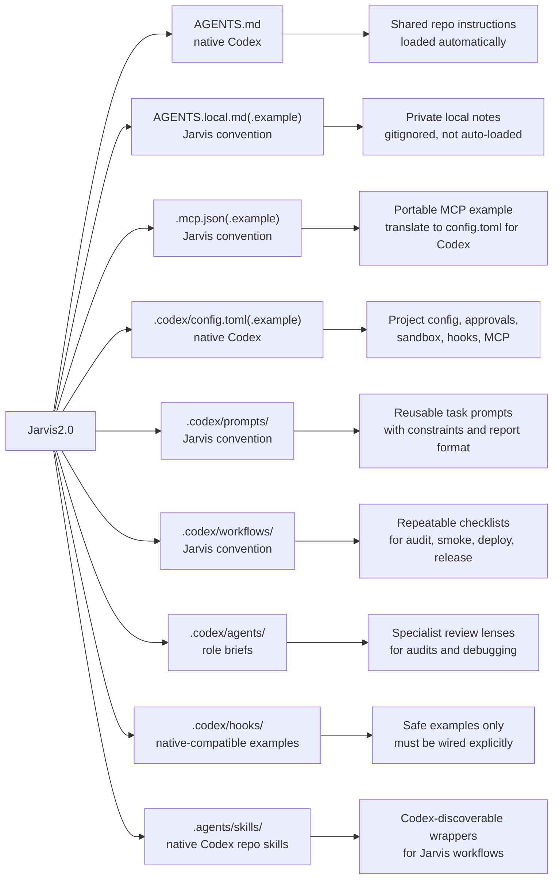

# Jarvis2.0 Codex Workspace

This directory is the Codex workspace companion for Jarvis2.0.

Its goals are:

- document how Codex work should be organized in this repo
- provide reusable prompts for repeatable tasks
- provide workflow checklists for audits, smoke tests, deploys, and releases
- provide specialized agent role briefs
- provide safe local override examples
- provide optional MCP examples without committing secrets

This workspace is intentionally split between native Codex behavior and Jarvis project conventions.

## Native Codex Behavior vs Jarvis Project Convention

Native Codex behavior verified from official OpenAI Codex docs:

- `AGENTS.md` is loaded automatically
- `.codex/config.toml` is a native project-scoped Codex config location
- `.codex/hooks.json` or inline `[hooks]` in `.codex/config.toml` are native hook configuration forms
- repo-scoped skills live under `.agents/skills/`
- custom spawned agents can be defined with `.toml` files under `.codex/agents/`

Jarvis project conventions in this repo:

- `AGENTS.local.md.example`
- `.mcp.json.example`
- `.codex/prompts/`
- `.codex/workflows/`
- `.codex/agents/*.md`
- `.codex/config.local.toml.example`

These conventions are supporting docs and templates. They are useful for real work, but Codex does not auto-load all of them by filename alone.

Reference:

- [docs/codex-configuration-map.md](../docs/codex-configuration-map.md)

## Directory Explanation

### `AGENTS.md`

- Native Codex instruction file
- shared repo guidance
- should stay small, durable, and true

### `AGENTS.local.md.example`

- Jarvis project convention
- template for a gitignored private notes file
- not auto-loaded by Codex

### `.mcp.json.example`

- Jarvis project convention
- valid JSON example for teams who also use JSON-based MCP tooling
- Codex itself reads MCP from `config.toml`, not `.mcp.json`

### `.codex/config.toml.example`

- native Codex project-config example
- safe, non-secret starter for model, sandbox, approvals, hooks, and MCP

### `.codex/config.local.toml.example`

- Jarvis project convention
- private snippet file for machine-specific overrides
- not auto-loaded by Codex unless a user copies values into real native config or passes them with CLI overrides

### `.codex/prompts/`

- Jarvis project convention
- reusable task prompts with explicit constraints and report formats

### `.codex/workflows/`

- Jarvis project convention
- repeatable checklists for deploy, release, smoke, security, and service audits

### `.codex/agents/`

- mixed use
- `*.md` files here are Jarvis role briefs
- native custom Codex agents, if added later, should use `.toml` files in this same directory

### `.codex/hooks/`

- native-compatible example scripts
- safe by default and not enabled automatically
- intended to be wired explicitly through `.codex/config.toml` or `.codex/hooks.json`

### `.agents/skills/`

- native Codex repo skill location
- wrapper skills here let Codex discover the new Jarvis workflows without copying long instructions into `AGENTS.md`

## Safety Model

- local override files are not committed
- secrets never go into git
- hooks must fail safely and do no destructive work by default
- destructive commands require explicit approval through normal Codex sandbox and approval settings
- production deploy work requires smoke evidence before calling a task complete
- examples use placeholders only

## Recommended Workflow

1. Load `AGENTS.md` first.
2. Pick the closest reusable prompt under `.codex/prompts/`.
3. Follow the matching checklist under `.codex/workflows/`.
4. Use the relevant role brief under `.codex/agents/` or the matching native skill under `.agents/skills/`.
5. Run the smallest honest verification commands that match the change.
6. Write a final report with commands run, evidence gathered, and remaining risk.

## Mermaid Map

## Hook Enablement

These hook scripts are examples only until you wire them into native Codex config.

Preferred native wiring options:

- `.codex/hooks.json`
- inline `[hooks]` tables in `.codex/config.toml`

See:

- [.codex/config.toml.example](./config.toml.example)
- [.codex/hooks/README.md](./hooks/README.md)

## Local Override Guidance

Safe local files to keep private:

- `AGENTS.local.md`
- `.mcp.json`
- `.codex/config.local.toml`

These are gitignored on purpose.

## No Image Asset

A Codex structure image was not found in the workspace, so this README uses Mermaid only.

## Official Docs Verified

- <https://developers.openai.com/codex/guides/agents-md>
- <https://developers.openai.com/codex/config-basic>
- <https://developers.openai.com/codex/mcp>
- <https://developers.openai.com/codex/hooks>
- <https://developers.openai.com/codex/subagents>
- <https://developers.openai.com/codex/cli/slash-commands>
- <https://developers.openai.com/codex/skills>
