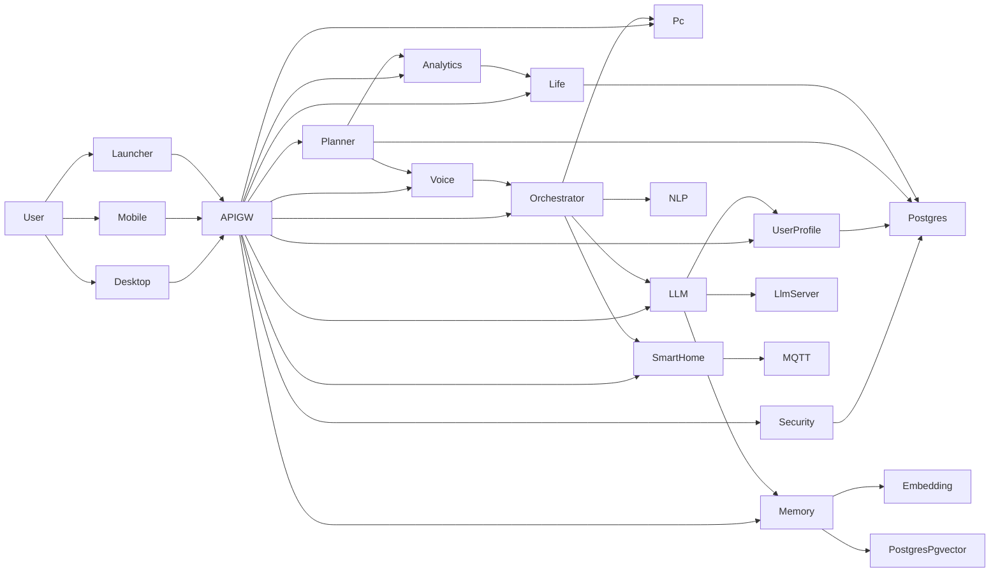

# Architecture Explained: Jarvis

## The Architecture In One Paragraph

Jarvis is mostly an **HTTP-first microservice system**.

Clients talk to `api-gateway`. The gateway routes requests to backend services. For command execution, the real "brain" today is `orchestrator`, which asks `nlp-service` to classify text and then routes actions to deterministic executors such as `pc-control` or `smart-home-service`. Planning, life tracking, analytics, auth, and user data live in their own services. LLM and memory services exist, but they are optional layers on top of the core runtime rather than the center of the system.

Confidence: **high**

## High-Level Reality Map

Important correction to the older diagrams:

- `analytics-service` does **not** own its own PostgreSQL persistence layer in the current code. It calls `life-tracker` over HTTP.

Confidence: **high**

## Runtime Modes

| Mode | What Is Running | What This Means | Evidence | Confidence |
| --- | --- | --- | --- | --- |
| Default local runtime | Core Java backend + local Postgres | Real assistant backend without mandatory LLM or memory | `scripts/runtime-up.sh`, `scripts/runtime/common.sh` | high |
| Local runtime with memory | Core backend + `embedding-service` + `memory-service` | Adds real semantic memory path with pgvector | `scripts/runtime-up.sh`, `.github/workflows/backend-readiness.yml` | high |
| Local runtime with LLM | Core backend + optional `llm-server` + `llm-service` | Adds local chat/orchestration path, still optional | `scripts/runtime-up.sh`, `docker/llm-server`, `apps/llm-service` | high |
| Prod overlay default | Core services deployed, optional AI scaled to `0` | Production claim is backend-first, not AI-first | `k8s/overlays/prod/llm-service.yaml`, `memory-service.yaml`, `embedding-service.yaml`, `llm-server.yaml` | high |

## Layers

## Entry Points

### `api-gateway`

Role:

- main public HTTP entry point
- public WebSocket proxy
- local JWT validation
- request forwarding to backend services

Evidence:

- `apps/api-gateway/src/main/resources/application.yaml`
- `apps/api-gateway/src/main/java/org/jarvis/apigateway/controller`
- `apps/api-gateway/src/main/java/org/jarvis/apigateway/websocket`
- `k8s/base/ingress.yaml`

Confidence: **high**

### `voice-gateway`

Role:

- voice ingestion
- STT/TTS
- voice session WebSocket handling
- internal notification delivery

Important nuance:

- `voice-gateway` is a real service
- public voice traffic still goes through `api-gateway` in the Kubernetes ingress story

Evidence:

- `apps/voice-gateway/src/main/resources/application.yaml`
- `apps/api-gateway/src/main/java/org/jarvis/apigateway/websocket/VoiceWebSocketProxyHandler.java`
- `k8s/base/ingress.yaml`

Confidence: **high**

## Core Orchestration

### `nlp-service`

What it really is:

- a deterministic rule-based command parser
- not a model-serving NLP stack

Evidence:

- `apps/nlp-service/src/main/java/org/jarvis/nlp/service/impl/RuleBasedNlpService.java`
- `apps/nlp-service/src/main/java/org/jarvis/nlp/service/impl/EnhancedRuleBasedNlpService.java`

Confidence: **high**

### `orchestrator`

What it really is:

- the main command brain
- receives text/intents
- calls `nlp-service`
- routes actions to executors
- uses LLM only as a fallback/optional path

Evidence:

- `apps/orchestrator/src/main/java/org/jarvis/orchestrator/service/impl/OrchestratorServiceImpl.java`
- `apps/orchestrator/src/main/resources/application.yml`

Confidence: **high**

## Domain Services

### `security-service`

- owns auth and JWT issuance
- backed by PostgreSQL

### `user-profile`

- owns preferences, goals, habits, priorities
- more real than some of its current consumers

### `planner-service`

- owns tasks, reminders, planner tool endpoints
- mixed quality: solid reminder/task core, but some intelligence features are placeholders

### `life-tracker`

- strongest domain system-of-record service in the repo
- owns finance, calendar, and time-tracking data

### `analytics-service`

- stateless aggregator over `life-tracker`
- does not own its own DB in current code

### `pc-control`

- executes local OS/desktop actions
- one of the most concrete execution services in the repo

### `smart-home-service`

- owns smart-home device views and action routing
- local runtime defaults to mock provider

Confidence for this section: **high**

## AI Support Services

### `llm-service`

Role:

- Java-side AI orchestration layer
- prompt building
- session memory
- tool planning
- optional access to user profile and long-term memory

Runtime truth:

- real code
- optional at runtime
- not required for the default product contour

Evidence:

- `apps/llm-service/src/main/java/org/jarvis/llm/controller`
- `apps/llm-service/src/main/resources/application.yml`
- `k8s/overlays/prod/llm-service.yaml`

Confidence: **medium-high**

### `llm-server`

Role:

- Python inference worker
- serves the actual model backend

Runtime truth:

- real code exists
- feature-flagged / optional
- scaled to `0` in prod overlay

Evidence:

- `docker/llm-server/app/main.py`
- `docker/llm-server/app/model_loader.py`
- `k8s/overlays/prod/llm-server.yaml`

Confidence: **medium-high**

### `memory-service`

Role:

- long-term memory ingestion
- vector search
- session summarization

Runtime truth:

- real implementation
- optional
- backed by pgvector

Evidence:

- `apps/memory-service/src/main/java/org/jarvis/memory/entity/MemoryChunk.java`
- `apps/memory-service/src/main/java/org/jarvis/memory/repository/MemoryChunkRepository.java`
- `apps/memory-service/src/main/resources/application.yml`

Confidence: **high**

### `embedding-service`

Role:

- Python embedding worker for memory search

Runtime truth:

- real implementation
- optional

Evidence:

- `docker/embedding-service/app/main.py`
- `docker/embedding-service/app/embedder.py`
- `k8s/overlays/prod/embedding-service.yaml`

Confidence: **high**

## Storage And Infrastructure

### PostgreSQL

Used by:

- `security-service`
- `user-profile`
- `planner-service`
- `life-tracker`
- `memory-service`

Important nuance:

- local runtime uses a managed `pgvector/pgvector:pg16` container even for the default local setup
- production overlay separates normal Postgres and optional pgvector-oriented Postgres

Evidence:

- `scripts/runtime/common.sh`
- `k8s/base/postgres`
- `k8s/overlays/prod/postgres-pgvector.yaml`

Confidence: **high**

### Mosquitto / MQTT

Used by:

- `smart-home-service`

Important nuance:

- MQTT is real, but only for the smart-home transport path
- it is not the general message bus of Jarvis

Evidence:

- `apps/smart-home-service/src/main/java/org/jarvis/smarthome/config/MqttConfig.java`
- `apps/smart-home-service/src/main/java/org/jarvis/smarthome/service/impl/MqttSmartHomeTransport.java`
- `k8s/base/mosquitto`

Confidence: **high**

## Real Interaction Map

| Caller | Callee | Protocol | Sync / Async | Mandatory For Default Runtime | What It Is Used For | Evidence | Confidence |
| --- | --- | --- | --- | --- | --- | --- | --- |
| Desktop client | `api-gateway` | HTTP | sync | no | auth + API access | `apps/desktop-client-javafx/src/main/kotlin/org/jarvis/desktop/api/ApiClient.kt` | high |
| Desktop client | `api-gateway` | WebSocket | async | no | PC control + voice events | `PcControlWebSocketClient.kt`, `VoiceWebSocketClient.kt` | high |
| Launcher | local runtime + gateway | shell + HTTP | mixed | no | start/stop/health | `apps/launcher-javafx`, `jarvis-launch.sh` | high |
| Mobile client | `api-gateway` | HTTP | sync | no | basic audio streaming path | `apps/mobile-client` | medium-high |
| `api-gateway` | backend services | HTTP/Feign | sync | yes | main internal routing | `apps/api-gateway/src/main/java/org/jarvis/apigateway/client` | high |
| Public `/ws/voice` | `voice-gateway` | WebSocket proxy | async | yes | voice session proxying | `VoiceWebSocketProxyHandler.java` | high |
| Public `/ws/pc-control` | gateway handler | WebSocket | async | yes | PC action events to clients | `apps/api-gateway/src/main/java/org/jarvis/apigateway/websocket` | high |
| `voice-gateway` | `orchestrator` | HTTP | sync | yes | convert transcript/command to action | `apps/voice-gateway/src/main/resources/application.yaml` | high |
| `orchestrator` | `nlp-service` | HTTP | sync | yes | intent parsing | `apps/orchestrator` client wiring | high |
| `orchestrator` | `pc-control` | HTTP | sync | yes | desktop action execution | `apps/orchestrator` clients | high |
| `orchestrator` | `smart-home-service` | HTTP | sync | yes | smart-home action execution | `apps/orchestrator` clients | high |
| `orchestrator` | `llm-service` | HTTP | sync | no | fallback/optional language layer | `apps/orchestrator` LLM client + config | high |
| `planner-service` | `voice-gateway` | HTTP | sync | yes | reminder notifications | `planner-service` controllers/services, `voice-gateway` internal notification controller | high |
| `planner-service` | `analytics-service` | HTTP | sync | yes | analytics-fed planner views | `planner-service` clients | high |
| `analytics-service` | `life-tracker` | HTTP/Feign | sync | yes | source data for analytics | `apps/analytics-service/src/main/java/.../LifeTrackerClient.java` | high |
| `llm-service` | `llm-server` | HTTP | sync | no | inference | `apps/llm-service` + `docker/llm-server` | medium-high |
| `llm-service` | `memory-service` | HTTP | sync | no | RAG / retrieval | `apps/llm-service` memory client | medium-high |
| `llm-service` | `user-profile` | HTTP | sync | no | personalization | `apps/llm-service` user profile client | medium-high |
| `memory-service` | `embedding-service` | HTTP | sync | no | embeddings for search | `apps/memory-service` embedding client | high |
| `smart-home-service` | Mosquitto | MQTT | async-ish transport | yes, but local mock can replace real broker dependency | outbound smart-home commands | `MqttConfig.java`, `MqttSmartHomeTransport.java` | high |

## The Main Flows

## Text Command Flow

1. Client sends text to `api-gateway`.
2. Gateway forwards to `orchestrator`.
3. `orchestrator` asks `nlp-service` to parse the command.
4. `orchestrator` decides whether to call `pc-control`, `smart-home-service`, or just return a phrase.
5. Optional: `orchestrator` may use `llm-service` as a fallback.

This is the clearest current "assistant" path in the repo.

Confidence: **high**

## Voice Flow

1. Client uploads audio or opens `/ws/voice`.
2. `api-gateway` proxies public voice WebSocket traffic to `voice-gateway`.
3. `voice-gateway` transcribes audio through Vosk, Whisper, or NoOp fallback.
4. `voice-gateway` forwards the interpreted command to `orchestrator`.
5. `orchestrator` routes execution.
6. `voice-gateway` produces speech through pre-recorded WAV or TTS fallback.

Important nuance:

- voice is real
- but it is still built around the same backend routing core, not a separate intelligence stack

Confidence: **high**

## Planner Reminder Flow

1. Planner stores reminder data in its own DB.
2. Scheduler wakes up using Spring scheduling.
3. Planner sends notifications to `voice-gateway`.
4. Desktop and voice channels receive the reminder.

Confidence: **high**

Evidence:

- `apps/planner-service/src/main/java/org/jarvis/planner/service/ReminderScheduler.java`
- `scripts/runtime-smoke.sh`

## Memory / AI Flow

1. Client or service calls `llm-service`.
2. `llm-service` builds prompt context.
3. Optional retrieval from `memory-service`.
4. `memory-service` calls `embedding-service` for vectors.
5. `llm-service` calls `llm-server` for generation.
6. Tool plans are converted back into deterministic service calls.

Important nuance:

- this flow is real
- this flow is not the default always-on product path

Confidence: **medium-high**

## Direct Answers To The Most Important Architecture Questions

### Is Jarvis really HTTP-first?

**Yes.**

The current repo is clearly HTTP-first.

Why:

- gateway routing is HTTP/Feign-based
- service-to-service calls are mostly Feign, `RestTemplate`, or `WebClient`
- the default runtime and CI smoke paths depend on HTTP endpoints

Evidence:

- `apps/api-gateway/src/main/java/org/jarvis/apigateway/client`
- `apps/analytics-service/src/main/java/org/jarvis/analytics/client/LifeTrackerClient.java`
- `apps/planner-service/src/main/java/org/jarvis/planner/client`
- `apps/memory-service` embedding client

Confidence: **high**

### Where is WebSocket really used?

Real current WebSocket usage:

- public and desktop-facing voice path
- public and desktop-facing PC control path
- internal/direct `voice-gateway` voice handler

Also present but not clearly used by repo clients:

- `llm-service` STOMP/SockJS endpoint `/ws/jarvis-llm`

Evidence:

- `apps/api-gateway/src/main/java/org/jarvis/apigateway/websocket`
- `apps/voice-gateway/src/main/java/org/jarvis/voicegateway/config/WebSocketConfig.java`
- `apps/llm-service/src/main/java/org/jarvis/llm/config/WebSocketConfig.java`

Confidence: **high**

### Where is MQTT really needed?

Real current usage:

- outbound transport inside `smart-home-service`

Not real current usage:

- general internal event bus for the platform

Confidence: **high**

### Are Kafka or RabbitMQ really used today?

**There is no strong evidence that Kafka or RabbitMQ are part of the real current runtime behavior.**

What exists:

- dependencies
- configuration blocks
- feature flags

What is missing:

- active listeners
- active producer flow used by the main runtime
- CI/runtime smoke proof

Confidence: **high**

## Mandatory Versus Optional

### Mandatory For The Repo-Supported Default Runtime

- `api-gateway`
- `security-service`
- `voice-gateway`
- `nlp-service`
- `orchestrator`
- `pc-control`
- `smart-home-service`
- `planner-service`
- `life-tracker`
- `analytics-service`
- `user-profile`
- PostgreSQL

Confidence: **high**

### Optional

- `llm-service`
- `llm-server`
- `memory-service`
- `embedding-service`
- real hardware-backed MQTT device flow
- computer-vision monitoring
- Android client

Confidence: **high**
