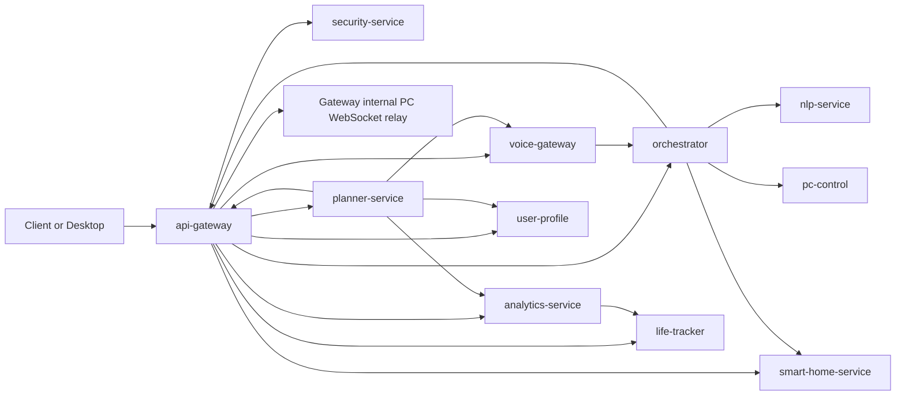

# Core Backend Architecture

Last updated: **2026-03-27**

This document describes the real current architecture of the Jarvis core backend, not the broader product vision.

## Runtime Topology

## Protocols

- Public ingress: HTTP/HTTPS and WebSocket/WSS through `api-gateway`
- Core service-to-service calls: HTTP with service JWT / internal headers
- Desktop action delivery: gateway internal HTTP -> gateway WebSocket relay
- Voice streaming: WebSocket via gateway proxy to `voice-gateway`

## Real Dependency Graph

- `api-gateway`
  - required downstreams: `security-service`, `orchestrator`, `voice-gateway`, `planner-service`, `life-tracker`, `analytics-service`, `smart-home-service`
  - optional downstream gated off by default: `memory-service`
- `voice-gateway`
  - required: `orchestrator`
- `orchestrator`
  - required: `nlp-service`
  - required for execution: `smart-home-service`
  - required for desktop-visible action delivery: gateway internal PC route
  - still contains direct `pc-control` client usage for some actions
- `planner-service`
  - required: `analytics-service`, `user-profile`, `voice-gateway`, gateway internal PC route
  - optional and disabled by default: `llm-service`
- `analytics-service`
  - required: `life-tracker`
- `security-service`, `user-profile`, `life-tracker`, `pc-control`, `smart-home-service`, `nlp-service`
  - system-of-record or execution services; no mandatory core fan-out beyond the calls above

## Critical Flows

### 1. Auth And Identity

1. Client calls `api-gateway`.
2. `api-gateway` delegates auth flows to `security-service`.
3. Gateway-enforced identity is propagated to downstream services via headers/JWT.

### 2. Text Command To Desktop Action

1. Client calls `api-gateway /api/v1/orchestrator/execute`.
2. `api-gateway` calls `orchestrator`.
3. `orchestrator` calls `nlp-service`.
4. `orchestrator` routes the result to `pc-control` and/or the gateway internal PC relay.
5. Desktop/WebSocket client receives the action.

### 3. Voice Text Command To Real Assistant Reply

1. Client calls `api-gateway /api/v1/voice/command`.
2. `api-gateway` proxies to `voice-gateway`.
3. `voice-gateway` calls `orchestrator`.
4. `orchestrator` returns the real assistant reply.
5. `voice-gateway` returns that real reply to the caller.

### 4. Planner Reminder Delivery

1. Reminder is created in `planner-service`.
2. `planner-service` pushes desktop notification via gateway internal PC route.
3. `planner-service` also calls `voice-gateway` internal notification endpoint.
4. Desktop and voice websocket clients receive the reminder.

### 5. Analytics Derivation

1. Data is written into `life-tracker`.
2. `analytics-service` aggregates finance, time, and calendar data from `life-tracker`.
3. `api-gateway` and `planner-service` consume those analytics results.

## Optional Edges Kept Outside Core Ready Claim

- `planner-service -> llm-service`
- `api-gateway -> memory-service`
- `llm-service -> llm-server`
- `llm-service -> memory-service`
- `memory-service -> embedding-service`

These are real or partial optional integrations, but they are not required for the core backend runtime to be considered complete.
