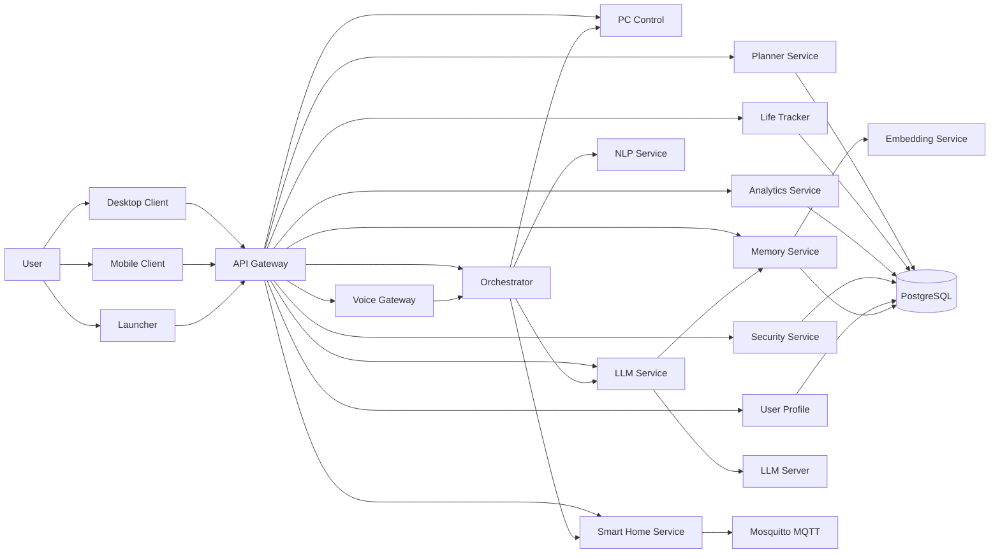

# Jarvis

**Jarvis is a privacy-first, offline-capable AI assistant platform for voice interaction, personal planning, device control, and local intelligence orchestration.**

It is designed as a real system, not a chatbot demo: a multi-service backend, dedicated voice pipeline, deterministic tool execution, desktop UX, optional local LLM inference, and Kubernetes-native deployment. The goal is simple: keep assistant-grade convenience without making cloud dependency a requirement.


- **Architecture:** [docs/architecture.md](docs/architecture.md)
- **Core backend reality:** [CORE_BACKEND_REALITY.md](CORE_BACKEND_REALITY.md)
- **Core backend architecture:** [CORE_BACKEND_ARCHITECTURE.md](CORE_BACKEND_ARCHITECTURE.md)
- **Core backend operations:** [CORE_BACKEND_OPERATIONS.md](CORE_BACKEND_OPERATIONS.md)
- **Core backend gaps:** [CORE_BACKEND_GAPS.md](CORE_BACKEND_GAPS.md)
- **Broader backend release status:** [docs/BACKEND_STATUS.md](docs/BACKEND_STATUS.md)
- **Computer vision security monitoring:** [docs/security/computer-vision-monitoring.md](docs/security/computer-vision-monitoring.md)

## Product Overview

Jarvis combines three layers that are usually scattered across separate products:

- **Interaction layer** for voice, text, desktop, and real-time control.
- **Decision layer** for NLP, orchestration, planning, and local LLM-assisted reasoning.
- **Execution layer** for calendars, tasks, analytics, PC control, smart home, and memory.

The platform is built around an **offline-first philosophy**:

- local speech recognition where possible
- local LLM inference for advanced reasoning
- local memory and user data storage
- no mandatory SaaS dependency for core workflows

This makes Jarvis suitable for:

- personal AI systems
- smart home control hubs
- productivity assistants
- research and portfolio projects that need real backend depth
- privacy-sensitive assistant deployments

## Current Status

Jarvis is an actively evolving platform.

The canonical source of truth for the current core backend is the `CORE_BACKEND_*` document set above. This README stays product-level on purpose.

Core backend services, the desktop client, the launcher, the Kubernetes deployment path, the voice pipeline foundations, and local AI integration paths are implemented in this repository today.

Some capabilities are intentionally optional at runtime, and some are partial or still being formalized.

- **Implemented:** core services, desktop client, launcher, JWT auth, voice gateway, planner, life-tracker, analytics, smart-home integration, Kubernetes launch path
- **Optional / feature-flagged:** `llm-service`, `llm-server`, `memory-service`, `embedding-service`, selected RabbitMQ/Kafka hooks
- **Partial / in progress:** advanced memory quality, mobile parity, broader extension formalization, broader localization coverage

## Implemented Modules At a Glance

| Module | Role | Status |
| --- | --- | --- |
| `api-gateway` | Public HTTP/WebSocket entry point | Implemented |
| `voice-gateway` | STT, TTS, streaming voice pipeline | Implemented |
| `nlp-service` | Deterministic intent parsing | Implemented |
| `orchestrator` | Command routing and response composition | Implemented |
| `pc-control` | Desktop and OS automation | Implemented |
| `vision-service` | Computer vision inference and owner verification | Implemented |
| `smart-home-service` | IoT control over MQTT/local providers | Implemented |
| `life-tracker` | Calendar, finance, time tracking | Implemented |
| `analytics-service` | Derived insight and reporting | Implemented |
| `planner-service` | Tasks, reminders, recommendations | Implemented |
| `security-service` | Authentication and JWT issuing | Implemented |
| `user-profile` | Preferences, goals, habits | Implemented |
| `llm-service` | Local AI chat and tool orchestration | Implemented, optional at runtime |
| `llm-server` | Local model inference worker | Optional / feature-flagged |
| `memory-service` | Long-term memory and retrieval | Implemented, optional at runtime |
| `embedding-service` | Vector embedding backend | Implemented, optional, used by memory path |
| `desktop-client-javafx` | Main end-user client | Implemented |
| `launcher-javafx` | Operational launcher and diagnostics UI | Implemented |
| `mobile-client` | Android companion app | Partial |

## Key Features

### Voice and Interaction

- **Voice Gateway** for STT, TTS, streaming audio, and low-latency voice sessions.
- **Desktop client** built with JavaFX/Kotlin for voice control, device control, analytics, and settings.
- **Launcher app** that starts the backend, shows health, exposes diagnostics, and handles optional AI feature flags.
- **WebSocket support** for real-time voice and interactive assistant workflows.

### Personal Intelligence

- **Planner service** for tasks, reminders, daily plans, and habit-oriented recommendations.
- **Life-tracker service** for finance, calendar, and time tracking.
- **Analytics service** for summarized insight over tracked activity and spending.
- **User profile service** for preferences, goals, priorities, and personalization context.
- **Memory service** for long-term recall, semantic retrieval, and future RAG workflows.

### AI Orchestration

- **Rule-based NLP** for fast, deterministic intent recognition.
- **Local LLM integration** through a Java orchestration layer and a separate Python inference server.
- **Tool-driven action model** so the model plans actions, while domain services remain the system of record.
- **Structured tool schemas** in JSON and confirmation gates for sensitive actions such as calendar changes.

### Device and Environment Control

- **PC control** for desktop actions, media control, browser/app launch, scenarios, and input automation.
- **Computer vision security monitoring** split between `vision-service` for face detection and verification, and `pc-control` for webcam capture, evidence collection, and alert delivery.
- **Smart home service** with MQTT-based device action routing and local/mock provider support.
- **Scenario catalogs** defined in YAML to extend assistant behavior without hardcoding every flow.

### Platform and Security

- **API Gateway** as the single public entry point for HTTP and WebSocket traffic.
- **JWT-based authentication** with local validation at the gateway.
- **Service-to-service trust model** using internal headers and service JWTs.
- **Dockerized services** and **Kubernetes deployment** with Kustomize overlays.
- **Network hardening** through ingress, secrets isolation, and Kubernetes policy foundations.

## Architecture Overview

Jarvis follows a microservice architecture with roughly a dozen runtime workloads plus desktop/mobile clients and AI support services.



### What This Architecture Optimizes For

- **Privacy by default:** local storage and local AI remain first-class.
- **Deterministic execution:** domain services own mutations; AI does not directly write to databases.
- **Graceful degradation:** voice, core automation, and data services can remain usable even when optional AI workloads are offline.
- **Operational realism:** containerized services, health checks, Kubernetes manifests, acceptance scripts, and feature-flagged optional workloads are all present in the repository.

## Tech Stack

| Layer | Technologies |
| --- | --- |
| Backend | Java 21, Spring Boot 3.3, Spring Cloud OpenFeign, Flyway, HikariCP |
| AI orchestration | Java LLM service, JSON tool registry, prompt orchestration, token budgeting |
| Local inference | Python FastAPI, Transformers, `llama.cpp` backend support, local LLaMA-family models |
| Voice | Vosk, Whisper integration path, pre-recorded WAV assets, local TTS provider abstraction |
| Data | PostgreSQL, pgvector, JPA/Hibernate |
| Messaging | MQTT via Mosquitto; optional RabbitMQ/Kafka integration hooks exist behind feature flags |
| Clients | JavaFX + Kotlin desktop apps, Android mobile client scaffold |
| Infra | Docker, Kustomize, Kubernetes, ingress-nginx, TLS automation scripts |
| Security | JWT, service JWT, request filtering, Kubernetes secrets, NetworkPolicy, Kyverno policies |
| Tooling | Maven multi-module build, Gradle for Android, shell automation, acceptance and smoke scripts |

## System Highlights

- **AI is orchestrated, not trusted blindly.** Jarvis uses LLMs as planning and language layers, while domain services keep control of business rules and persistence.
- **Offline-first is an architectural choice, not a marketing bullet.** Speech, memory, device control, and inference are designed to work locally.
- **Voice is treated as a system concern.** There is a dedicated voice gateway, streaming WebSocket flow, command catalogs, WAV registry, and response routing.
- **The project has real operational depth.** It includes launcher UX, TLS automation, Kubernetes overlays, image build/import scripts, and acceptance verification.
- **Extension points already exist.** Voice commands, desktop scenarios, tool schemas, and response catalogs are externalized through YAML/JSON assets instead of hardcoded switch blocks alone.

## Why Jarvis Is Technically Interesting

- demonstrates real microservice decomposition instead of a single assistant process
- combines voice interaction, AI orchestration, and deterministic execution in one system
- shows how local-first design changes architecture decisions around models, storage, and failure handling
- includes security, deployment, and degraded-mode considerations, not only feature endpoints
- works both as a product prototype and as a distributed-systems case study

## Use Cases

### Personal Command Center

Use Jarvis as a desktop assistant that can launch apps, change volume, trigger focus mode, speak responses, and surface personal analytics from one interface.

### Privacy-First Smart Home Hub

Run Jarvis locally to control lights, scenes, and device states over MQTT without routing every command through a third-party cloud assistant.

### AI Productivity Layer

Combine tasks, reminders, calendar slots, tracked work sessions, and spending analysis into one assistant that can reason over your own data.

### Local AI Research Platform

Use the system as a practical reference for building LLM-assisted products that separate orchestration from deterministic business services.

### Portfolio or Thesis-Grade Distributed System

The codebase is strong enough to discuss service decomposition, security boundaries, AI integration strategy, infrastructure tradeoffs, and degraded-mode behavior in interviews or academic defense.

## Getting Started

Jarvis currently ships with a **Kubernetes-first golden path** and a lighter **local runtime path** for faster developer loops.

### Prerequisites

| Requirement | Notes |
| --- | --- |
| Java 21+ | Required for backend and JavaFX modules |
| Maven 3.8+ | Main multi-module build |
| Docker | Image builds and some local dependencies |
| `kubectl` | Required for the Kubernetes launch path |
| Single-node local Kubernetes | Repository scripts target k3s today; manifests stay compatible with standard local clusters |
| Optional NVIDIA GPU | Only needed for accelerated local LLM inference |

### 1. Prepare local secrets

```bash
mkdir -p ~/.jarvis/secrets
cp secrets/secrets.example.env ~/.jarvis/secrets/secrets.env
chmod 600 ~/.jarvis/secrets/secrets.env
./scripts/product/jarvis-secrets-apply.sh
```

### 2. Prepare TLS and local hostnames

```bash
./scripts/product/jarvis-generate-certs.sh
sudo ./scripts/product/jarvis-install-tls.sh
sudo ./scripts/product/jarvis-setup-hosts.sh
```

`jarvis-generate-certs.sh` now creates both the edge certificate pair and the
local Java artifacts needed for self-signed HTTPS/WSS development:

- `~/.jarvis/tls/jarvis-keystore.p12`
- `~/.jarvis/tls/jarvis-cacerts.jks`

### 3. Optional: add local models

Place local assets in the repository model tree:

```text
models/
├── llm/
│   └── your-model.gguf
└── stt/
    ├── vosk/
    └── whisper/
```

### 4. Launch the platform

Core platform:

```bash
./jarvis-launch.sh
```

Core platform plus optional AI workloads:

```bash
ENABLE_LLM=true ENABLE_MEMORY=true ./jarvis-launch.sh
```

For digest-pinned backend deployment to a cluster, use the release flow in [DEPLOYMENT_INSTRUCTIONS.md](DEPLOYMENT_INSTRUCTIONS.md) instead of `jarvis-launch.sh`.

### 5. Verify the backend deployment

```bash
./scripts/product/jarvis-deploy-prod.sh --preflight-only
./scripts/product/jarvis-deploy-prod.sh
./scripts/product/jarvis-rollout-validate.sh --overlay=./k8s/overlays/prod-release
```

`scripts/verify-ai.sh` and `scripts/product/jarvis-run-acceptance.sh` remain broader
full-system checks. They are not the primary backend release gate.

For the carried-forward verified internal-TLS deployment target:

```bash
./scripts/product/jarvis-deploy-prod-internal-tls-verified.sh
./scripts/product/jarvis-smoke-prod-internal-tls-verified.sh
```

### 6. Open the product surfaces

- API: `https://api.jarvis.local`
- Voice WebSocket: `wss://voice.jarvis.local`
- Launcher: JavaFX launcher app for operations and diagnostics
- Desktop: JavaFX desktop client for everyday assistant usage

TLS boundary:

- external access is HTTPS/WSS-complete
- local runtime can also expose the gateway over self-signed HTTPS/WSS
- twenty-one in-cluster internal HTTPS hops are now verified:
  `ingress -> api-gateway`, `api-gateway -> nlp-service`,
  `planner-service -> api-gateway`, `orchestrator -> api-gateway`,
  `voice-gateway -> api-gateway`, `api-gateway -> security-service`,
  `api-gateway -> analytics-service`, `api-gateway -> pc-control`,
  `api-gateway -> life-tracker`, `api-gateway -> smart-home-service`,
  `api-gateway -> orchestrator`, `api-gateway -> voice-gateway`,
  `voice-gateway -> orchestrator`, `analytics-service -> life-tracker`,
  `orchestrator -> nlp-service`, `planner-service -> analytics-service`,
  `api-gateway -> planner-service`, `planner-service -> voice-gateway`,
  `voice-gateway -> smart-home-service`, `orchestrator -> smart-home-service`,
  and `orchestrator -> pc-control`
- the promoted overlay `k8s/overlays/prod-release-internal-tls-verified`
  is now the first-class deploy target for that already-verified twenty-one-hop state
- `api-gateway` now keeps internal HTTP on `8080` and also serves internal HTTPS on
  `8443` for the migrated callers in the dedicated internal-TLS overlays
- remaining HTTP is now an explicit exception set, not hidden drift:
  category A, closeable after contract work: `planner-service -> user-profile`,
  `planner-service -> life-tracker`
  category B, closeable only after service rollout redesign:
  `user-profile` listener and probes on `8089`
  category C, optional or model-adjacent: `memory-service -> embedding-service`
  category D, excluded from the current verified scope:
  `llm-service -> llm-server`, `llm-service -> memory-service`,
  `llm-service -> user-profile`
- full internal TLS and mTLS are not complete yet

See [docs/HTTPS_STANDARD.md](docs/HTTPS_STANDARD.md) for the exact model.

### Local Runtime for Faster Development

For local LLM work, the repo-local runtime is now the primary path.

Prepare the local env and check model placement:

```bash
./scripts/setup-local.sh
./scripts/check-local-env.sh
```

Start the local assistant stack:

```bash
ENABLE_LLM=true ./scripts/runtime-up.sh
```

Optional local self-signed HTTPS/WSS for the public gateway:

```bash
JARVIS_USE_TLS=true ENABLE_LLM=false ./scripts/runtime-up.sh
JARVIS_USE_TLS=true JARVIS_RUNTIME_SMOKE_SKIP_LLM=true JARVIS_SKIP_BUILD=true ./scripts/runtime-smoke.sh
```

Local analytics plus memory stack, without requiring a GGUF model:

```bash
ENABLE_LLM=false ENABLE_MEMORY=true ./scripts/runtime-up.sh
```

Inspect status and logs:

```bash
./scripts/runtime-status.sh
./scripts/llm-smoke.sh
```

Memory and analytics verification:

```bash
./scripts/memory-smoke.sh
./scripts/analytics-smoke.sh
```

Runbook for the local data stack:

- [docs/local-data-runtime.md](docs/local-data-runtime.md)
- [docs/HTTPS_STANDARD.md](docs/HTTPS_STANDARD.md)

Default local LLM expectations:

- One GGUF file under `models/llm/`, or `JARVIS_LLM_MODEL_PATH` set in `~/.jarvis/run/local-runtime/local.env`
- Recommended class: 7B/8B instruct GGUF, typically `Q4_K_M` or `Q5_K_M`
- Local backend: `llama.cpp` via the repo’s Python `llm-server`

## Project Structure

```text
Jarvis2.0/
├── apps/
│   ├── api-gateway/            # Public API entry point and WebSocket proxying
│   ├── voice-gateway/          # STT, TTS, streaming voice sessions
│   ├── nlp-service/            # Deterministic NLP and intent parsing
│   ├── orchestrator/           # Action routing and response composition
│   ├── pc-control/             # Desktop and system automation
│   ├── smart-home-service/     # IoT control over MQTT/local providers
│   ├── life-tracker/           # Calendar, finance, time tracking
│   ├── analytics-service/      # Derived metrics and summaries
│   ├── planner-service/        # Tasks, reminders, planning
│   ├── security-service/       # Authentication and JWT issuing
│   ├── user-profile/           # Preferences, goals, habits, priorities
│   ├── llm-service/            # LLM orchestration and tool planning
│   ├── memory-service/         # Long-term memory and retrieval
│   ├── jarvis-common/          # Shared security, tracing, logging utilities
│   ├── desktop-client-javafx/  # Main desktop product surface
│   ├── launcher-javafx/        # Operational launcher and diagnostics UI
│   └── mobile-client/          # Android client scaffold / companion app
├── docker/
│   ├── llm-server/             # Python inference server
│   ├── embedding-service/      # Vector embedding service
│   ├── postgres-init/          # DB bootstrap and pgvector setup
│   └── mosquitto/              # MQTT broker configuration
├── k8s/
│   ├── base/                   # Base manifests for core workloads
│   └── overlays/               # Environment-specific overlays
├── docs/                       # Technical architecture and operating docs
├── scripts/                    # Build, launch, diagnostics, acceptance
├── models/                     # Repo-local model storage
├── jarvis-launch.sh            # Golden path launcher
├── jarvis-stop.sh              # Runtime shutdown
└── pom.xml                     # Root Maven build
```

## Screens and UX

Jarvis already has a defined product surface even without screenshots in this README.

### Launcher

- service health states such as `IDLE`, `STARTING`, `READY`, and `DEGRADED`
- one-click backend start/stop
- toggles for LLM, memory, and GPU modes
- diagnostics export, log viewing, and acceptance entry points

### Desktop Client

- login flow with JWT-backed authentication
- main tabs for Home, Voice, Devices, PC Control, Life, Analytics, and Settings
- wake-word integration path via Porcupine
- runtime health monitoring and WebSocket-driven control feedback

### Mobile Client

- Android companion scaffold with audio streaming direction already present
- suited for lightweight remote control and voice capture as the mobile UX matures

The current UX direction is deliberate: **operations are separated from daily usage**. The launcher handles platform lifecycle; the desktop client handles assistant experience.

## Roadmap

### Stage 1: Product Hardening

- tighten public/private API boundaries
- improve observability and traces across service calls
- stabilize launcher-driven acceptance and release packaging

### Stage 2: Stronger Memory and Retrieval

- mature vector retrieval strategies and metadata filtering
- better session summarization and long-term recall quality
- richer user-profile personalization in prompt composition

### Stage 3: Automation and Extensibility

- turn current YAML/JSON extension contracts into a more formal extension model
- formalize scenario packs for smart home and desktop automation
- add more explicit approval workflows for higher-impact actions

### Stage 4: Client Expansion

- mobile companion from scaffold to supported surface
- better multi-device session continuity
- improved voice UX and broader localization packaging

### Stage 5: Scalability and Operations

- higher-availability data plane for database and broker layers
- stronger metrics, dashboards, and alerting
- more explicit multi-user and tenant isolation strategy

## Contribution and Philosophy

Jarvis is built around a few engineering principles:

- **assistant behavior should be explainable**
- **AI should not bypass deterministic services**
- **local-first should remain a serious option**
- **interfaces should stay extensible through contracts, not forks**
- **operations matter as much as features**

Contributions should preserve those constraints. New capabilities are welcome, but they should fit the platform model: clear service ownership, explicit contracts, testable behavior, and degradation paths that do not collapse the whole system.

## License

License to be defined.
