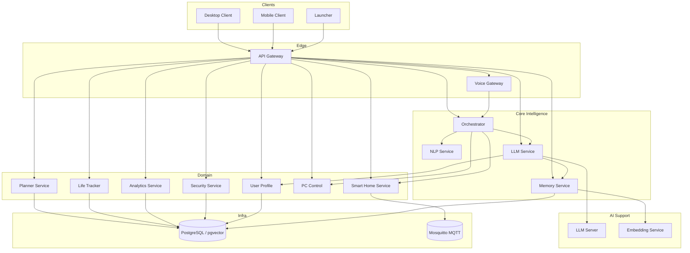
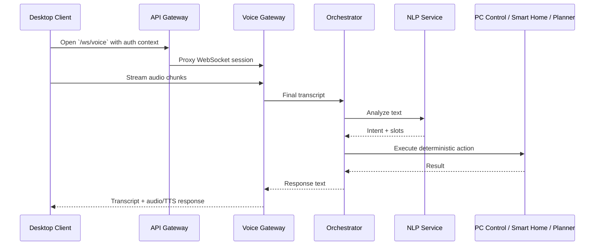
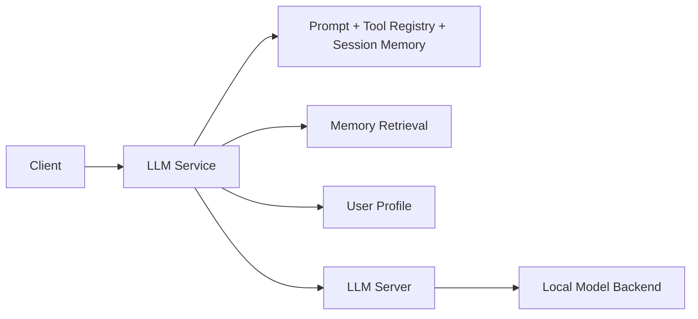

# Jarvis Architecture

## 1. High-Level Architecture

Jarvis is a **microservice-based intelligent assistant platform** with a clear separation between:

- **interaction services** that handle public traffic and real-time voice sessions
- **intelligence services** that interpret language and orchestrate actions
- **domain services** that own persistent business logic
- **AI support services** that provide local inference and memory retrieval
- **client applications** that expose the product to the user

The architecture is deliberately opinionated:

- **AI is not the source of truth**
- **domain services own state and validation**
- **voice is treated as a first-class protocol**
- **optional AI workloads must not take down core assistant functionality**

### Topology



### Architectural Intent

Jarvis is not a monolith with an LLM pasted on top. It is a system where:

- **user-facing requests enter through stable gateways**
- **semantic interpretation is isolated from execution**
- **execution happens in auditable domain services**
- **LLM-generated plans are converted into tool calls, not direct state mutations**

That distinction is what makes the platform defensible in production and explainable in design review.

## Current Delivery State

| Area | State | Notes |
| --- | --- | --- |
| Core backend services | Implemented | Gateways, auth, orchestration, planner, life-tracker, analytics, PC control, smart-home, user profile |
| Desktop product surface | Implemented | JavaFX desktop client and launcher are both active parts of the repo |
| Local LLM path | Implemented, optional at runtime | `llm-service` and `llm-server` exist, but are intentionally feature-flagged in the main runtime |
| Long-term memory | Implemented, optional at runtime | `memory-service` and `embedding-service` start through the local runtime, validate dependencies, and provide pgvector-backed recall |
| Mobile client | Partial | Android companion scaffold exists, but feature parity is not there yet |
| RabbitMQ / Kafka | Optional foundations only | Hooks exist in selected services, but they are not the primary runtime backbone today |
| Extension model | Implemented foundations | YAML/JSON catalogs and tool schemas exist; a more formal external extension model is still planned |
| Multilingual voice breadth | Partial | Current repo is strongest in the local Russian-centric voice path |
| Advanced approval workflows | Planned | Narrow confirmations exist today; broader approval policy is not a finished subsystem |

## 2. Service Breakdown

The sections below describe each major service in terms of responsibility, inputs and outputs, and primary dependencies.

### API Gateway — Implemented

- **Responsibility:** single public entry point for HTTP APIs and selected WebSocket traffic; local JWT validation; request routing; tool routing layer for downstream services.
- **Inputs/Outputs:** receives client requests on port `8080`; forwards proxied HTTP calls and WebSocket upgrades; injects `X-User-*` headers or service JWT context.
- **Dependencies:** security-service, orchestrator, voice-gateway, life-tracker, analytics-service, planner-service, smart-home-service, pc-control, llm-service, memory-service, jarvis-common.

### Voice Gateway — Implemented

- **Responsibility:** voice ingress/egress, streaming STT, TTS synthesis, command session handling, rule-based voice command catalogs, and voice response routing.
- **Inputs/Outputs:** accepts audio uploads, octet-stream audio, and WebSocket voice sessions; emits transcripts, assistant phrases, and synthesized audio.
- **Dependencies:** orchestrator, STT provider implementations (`Vosk`, `Whisper`, `NoOp`), TTS provider configuration, WAV asset registry, YAML command catalogs.

### NLP Service — Implemented

- **Responsibility:** deterministic intent recognition and slot extraction for fast-path command understanding.
- **Inputs/Outputs:** receives text for `/api/v1/nlp/analyze` and `/api/v1/nlp/analyze-enhanced`; returns intent plus extracted parameters.
- **Dependencies:** internal rule-based parsers and normalizers; no database dependency in the active path.

### Orchestrator — Implemented

- **Responsibility:** converts intents or raw text into executable actions; chooses between deterministic flows and LLM-assisted fallback; composes end-user responses.
- **Inputs/Outputs:** accepts raw text or precomputed intent payloads on `/api/v1/orchestrator/execute`; emits execution results and assistant phrasing.
- **Dependencies:** nlp-service, pc-control, smart-home-service, llm-service, API Gateway internal PC control route, phrase provider.

### PC Control — Implemented

- **Responsibility:** local desktop and operating-system automation such as media control, volume, browser/app launch, window/input actions, and named scenarios.
- **Inputs/Outputs:** receives structured action requests on `/api/v1/pc/action` and extended desktop-control routes; returns execution status, supported actions, and desktop state.
- **Dependencies:** local OS utilities, scenario registry loaded from YAML, command validation, optional RabbitMQ/Kafka hooks behind feature flags.

### Smart Home Service — Implemented

- **Responsibility:** device inventory exposure and action dispatch for IoT devices.
- **Inputs/Outputs:** exposes `/api/v1/smarthome/devices` and `/devices/{id}/action`; returns device views and action execution results.
- **Dependencies:** MQTT broker via Mosquitto, optional local/mock provider support, optional RabbitMQ/Kafka integration hooks.

### Life Tracker — Implemented

- **Responsibility:** persistent system of record for calendar events, finance transactions, budgets, recurring items, and time records.
- **Inputs/Outputs:** exposes CRUD-style endpoints for life data and dedicated tool endpoints for AI-safe calendar and finance operations.
- **Dependencies:** PostgreSQL, Flyway, service JWT validation, tool idempotency storage, calendar/finance domain services.

### Analytics Service — Implemented

- **Responsibility:** derived metrics and summaries for finance, time usage, sleep/work patterns, and calendar aggregates.
- **Inputs/Outputs:** exposes read-oriented analytics endpoints such as `/api/v1/analytics/overview`, expense trend summaries, and calendar/time summaries.
- **Dependencies:** life-tracker via Feign, PostgreSQL-backed data from upstream services, circuit-breaker-enabled service calls.

### Planner Service — Implemented

- **Responsibility:** task lifecycle, reminders, daily/weekly plan generation, recommendations, and task-oriented tool endpoints for the AI layer.
- **Inputs/Outputs:** exposes planner REST endpoints and tool routes such as `/api/v1/tools/todo/*`; returns tasks, reminders, plans, and recommendation payloads.
- **Dependencies:** PostgreSQL, analytics-service, life-tracker, user-profile, llm-service, voice-gateway notification path.

### Security Service — Implemented

- **Responsibility:** registration, login, refresh tokens, current-user identity lookup, and JWT issuance.
- **Inputs/Outputs:** accepts `/auth/register`, `/auth/login`, `/auth/refresh`, and `/auth/me`; returns access and refresh tokens plus authenticated identity.
- **Dependencies:** PostgreSQL, JWT secret configuration, password/user persistence, Flyway-managed security schema.

### User Profile Service — Implemented

- **Responsibility:** user preferences, goals, habits, priorities, and personalization context used by planning and LLM prompt composition.
- **Inputs/Outputs:** exposes profile and preferences endpoints for read/write personalization data.
- **Dependencies:** PostgreSQL, Flyway migrations, internal consumer services such as planner-service and llm-service.

### LLM Service — Implemented, Optional at Runtime

- **Responsibility:** AI interaction and orchestration layer; manages direct chat, dialog mode, WebSocket chat, tool planning, session memory, user personalization, and memory retrieval requests.
- **Inputs/Outputs:** exposes `/api/v1/llm/chat`, `/dialog`, `/orchestrate`, WebSocket `/app/llm-chat`; returns natural-language responses or structured tool plans.
- **Dependencies:** local Python LLM server, memory-service, user-profile, prompt templates, tool registry JSON, token budgeting logic.

### Memory Service — Implemented, Optional at Runtime

- **Responsibility:** long-term conversational and semantic memory, chunking, embedding, vector search, and session summaries.
- **Inputs/Outputs:** exposes `/memory/ingest`, `/memory/search`, `/memory/summarize-session`, and tool-oriented memory search endpoints.
- **Dependencies:** PostgreSQL with pgvector, a dedicated Flyway history table, embedding-service, chunking service, and authenticated user context.

### LLM Server — Optional / Feature-Flagged

- **Responsibility:** local inference worker that loads and runs the actual language model.
- **Inputs/Outputs:** receives HTTP requests from llm-service; returns generated text and health state.
- **Dependencies:** local model files, Python FastAPI runtime, Transformers backend and `llama.cpp` backend support, optional GPU.

### Embedding Service — Implemented, Optional at Runtime

- **Responsibility:** converts text into vector embeddings for semantic memory retrieval.
- **Inputs/Outputs:** accepts single and batch embedding requests; returns normalized E5 vectors and service health.
- **Dependencies:** sentence-transformer model stack, local Python runtime management, and CPU-friendly local serving.

### Desktop Client — Implemented

- **Responsibility:** primary user-facing application for sign-in, voice, devices, PC control, life data, analytics, and settings.
- **Inputs/Outputs:** consumes API Gateway and WebSocket endpoints; renders tabs and operational state to the user.
- **Dependencies:** JavaFX, Kotlin, HTTP/WebSocket clients, optional wake-word support through Porcupine.

### Launcher — Implemented

- **Responsibility:** operational control plane for local product startup, health inspection, diagnostics, and feature toggles.
- **Inputs/Outputs:** starts or stops backend services, exposes health state such as `READY` or `DEGRADED`, runs acceptance and diagnostics workflows.
- **Dependencies:** `jarvis-launch.sh`, `jarvis-stop.sh`, local runtime paths, JavaFX UI, health probes.

### Mobile Client — Partial

- **Responsibility:** companion mobile surface for future remote control and audio capture.
- **Inputs/Outputs:** Android app scaffold with basic activity structure and audio streaming direction.
- **Dependencies:** Android/Kotlin stack; currently partial and not feature-complete.

### Shared Infrastructure Components

#### PostgreSQL / pgvector — Implemented

- **Responsibility:** primary durable data store across security, planning, user profile, life-tracking, analytics inputs, and memory.
- **Inputs/Outputs:** stores relational data and vector embeddings; exposes schema-isolated persistence with Flyway migrations.
- **Dependencies:** all stateful domain services and memory-service.

#### Mosquitto MQTT — Implemented

- **Responsibility:** transport layer for smart-home actions and device communication.
- **Inputs/Outputs:** receives and publishes MQTT messages for smart-home control.
- **Dependencies:** smart-home-service and authenticated broker configuration.

## 3. Data Flow

### Voice Command Lifecycle



The most representative Jarvis flow is a voice command from the desktop client:

1. The desktop client opens a voice session through the public API Gateway or uploads audio through the public edge.
2. The voice gateway receives the proxied audio stream and normalizes session state.
3. The configured STT provider transcribes audio into text.
4. The voice gateway emits partial/final transcripts to the client.
5. Final transcript text is forwarded to the orchestrator.
6. The orchestrator calls nlp-service for intent extraction.
7. If confidence is sufficient, the orchestrator routes directly to the appropriate deterministic domain service.
8. If the query is more open-ended or tool-driven, the orchestrator or client-facing flow can use llm-service for tool planning or natural-language response generation.
9. The target domain service executes the action and persists any state changes.
10. The orchestrator returns a user-facing result string.
11. The voice gateway resolves a pre-recorded WAV asset or falls back to TTS synthesis.
12. The client receives spoken feedback and updated runtime state.

### Direct Planning / Tool Flow

For AI-assisted planning:

1. Client sends prompt to `llm-service`.
2. `llm-service` builds prompt context from short-term history, user profile, and optional memory retrieval.
3. For orchestration mode, the model returns `tool_calls` plus explanation only.
4. The client or gateway invokes `/api/v1/tools/*` endpoints with generated idempotency keys.
5. Planner, life-tracker, or memory services execute deterministic logic.
6. Results are returned as structured domain payloads, not model hallucinations.

### Smart Home Action Flow

1. Client or orchestrator calls the smart-home service with a device action.
2. Service validates device and action compatibility.
3. Action is published through MQTT or handled by the configured local/mock provider.
4. Execution result is returned synchronously to the caller.

## 4. Communication Patterns

Jarvis uses multiple communication styles, each for a specific reason.

### REST

REST is the primary control-plane protocol.

- Public client traffic enters through the API Gateway.
- Internal service calls use HTTP/Feign.
- Domain services expose explicit contracts for commands and queries.
- Tool endpoints provide a strict boundary for AI-generated actions.

REST is preferred where:

- idempotency matters
- business rules must be explicit
- auditability is important
- retries should be controlled at the application layer

### WebSocket

WebSockets are used where Jarvis needs low-latency bidirectional communication.

- **voice streaming** through the API Gateway proxy to the voice-gateway
- **LLM chat sessions** for interactive dialog
- **real-time assistant session behavior** from the desktop surface

This avoids forcing streaming voice interaction through inefficient polling or repeated upload cycles.

### Event-Driven Messaging

Jarvis does not currently rely on Kafka as the default production backbone. The event-driven model is more targeted:

- **MQTT is active today** for smart-home interaction.
- **RabbitMQ and Kafka hooks exist** in selected services behind feature flags as optional or future integration points.

That design is intentional:

- real product flows already work with REST + WebSocket + MQTT
- event streaming can be introduced selectively where decoupling adds value
- the system avoids pretending to be event-driven everywhere when the active runtime does not require it

## 5. LLM Integration

Jarvis separates **LLM orchestration** from **LLM inference**.

### Status

- **Implemented:** direct chat, dialog mode, orchestration endpoint, tool schema registry, local inference split
- **Optional / feature-flagged:** `llm-service` and `llm-server` in the main runtime path
- **Planned / evolving:** richer approval workflows, stronger personalization depth, more mature multi-step automation

### Why the Split Exists

- the Java service owns product logic, session handling, tool planning, and integration with user profile and memory
- the Python service owns model loading, backend selection, and token generation

This keeps the model runtime replaceable without forcing the rest of the platform to become Python-native.

### Current Design



### Inference Model

- `llm-service` is the public AI layer.
- `llm-server` is the local inference worker.
- model backends include **Transformers** and **`llama.cpp`** support.
- model files are loaded from the local `models/` tree.

### Orchestration Model

The `orchestrate` endpoint enforces a specific contract:

- the model returns only JSON
- the output is limited to `tool_calls` and `explanation`
- the model is not allowed to directly access databases or downstream APIs
- high-impact actions can be flagged for confirmation

This is the key product decision that keeps Jarvis credible as an assistant system rather than a prompt wrapper.

### Fallback Behavior

If the LLM path is disabled or unhealthy:

- the rule-based voice and NLP path still works
- core assistant commands continue to operate
- launcher and health reporting surface the system as `DEGRADED`, not dead

## 6. Memory System Design

Jarvis uses a layered memory model.

### Status

- **Implemented foundations:** ingestion, chunking, embeddings, pgvector storage, top-k search, session summaries
- **Optional / feature-flagged:** memory workloads are not required for the core assistant runtime
- **Partial / evolving:** ranking quality, metadata filtering, retention strategy, deeper recall orchestration

### Short-Term Memory

Short-term memory lives in `llm-service`.

- session-scoped in-memory history
- TTL-bound retention
- capped message count per session
- used to preserve conversational continuity during active interaction

This memory is fast and lightweight, but it is not the long-term source of truth.

### Long-Term Memory

Long-term memory lives in `memory-service`.

- conversation messages are ingested and persisted
- messages are chunked into retrieval-friendly units
- chunks are embedded through `embedding-service`
- vectors are stored in PostgreSQL with pgvector
- session summaries provide compressed recall

### Current Retrieval Concept

1. query arrives from `llm-service` or a tool request
2. memory-service requests embeddings for the query
3. vector similarity search returns top-k chunks
4. chunks are filtered by thresholds and token budget
5. results are injected into prompt context or returned directly

### Planned Evolution

The current design already supports semantic retrieval, but the natural next steps are:

- stronger metadata filtering by source and recency
- hybrid ranking with semantic plus symbolic filters
- background summarization and memory compaction
- user-level retention policies

## 7. Voice Pipeline

Jarvis treats voice as a pipeline, not a single API call.

### Pipeline Stages

```text
Audio In
  -> Voice Gateway session handling
  -> STT (Vosk by default, Whisper path available)
  -> Transcript events
  -> NLP / Orchestrator
  -> Domain action or LLM plan
  -> Spoken or textual result
  -> Voice Gateway response resolution
  -> Pre-recorded WAV or TTS output
  -> Audio Out
```

### Why This Matters

- STT and TTS stay isolated from business logic
- voice interaction can evolve independently of domain services
- pre-recorded responses can coexist with synthetic TTS for latency and personality control
- the client can observe intermediate states such as partial transcript, timeout, or STT unavailability

### Provider Strategy

The active repository already supports multiple STT/TTS directions:

- Vosk is the primary local STT path
- Whisper is present as an alternative STT provider path
- pre-recorded WAV responses provide instant branded feedback
- local TTS remains provider-configurable

The architecture is intentionally compatible with future adapters such as Piper or Coqui without requiring a redesign.

## 8. Security Model

Jarvis security combines application-level auth with Kubernetes isolation.

### Authentication and Identity

- users authenticate against `security-service`
- JWTs are issued centrally
- `api-gateway` validates JWTs locally
- downstream services receive trusted user context via headers such as `X-User-Id`, `X-Username`, and `X-User-Roles`

### Internal Service Trust

- internal routes can use service JWT signing
- shared filters from `jarvis-common` enforce consistent service-side handling
- domain services do not each re-implement full public authentication

### AI Safety Controls

- tool endpoints are explicit and narrow
- mutating tool calls require `X-Idempotency-Key`
- calendar mutations require confirmation flags
- finance tools in the current orchestration contract are read-oriented for analysis and budgeting, not payments

### Data Isolation

- PostgreSQL schemas are separated by service domain
- secrets are stored locally and applied as Kubernetes Secrets
- PII-aware logging utilities reduce accidental sensitive output

### Cluster-Level Controls

The Kubernetes deployment includes hardening foundations already visible in the repository:

- ingress and TLS termination
- NetworkPolicy allowlists
- dedicated ServiceAccounts for core workloads
- Kyverno admission policies
- non-root execution and read-only filesystem policies for core workloads

## 9. Deployment Model

### Containers

Each major service is containerized. Java services are built from the multi-module Maven project, while AI support services are defined in dedicated Docker contexts.

### Kubernetes

Jarvis is deployed through:

- `k8s/base` for shared manifests
- `k8s/overlays/prod` for production-style deployment
- optional overlays and scripts for local cluster operation

The active repository scripts target a **single-node local Kubernetes flow using k3s**, but the manifests are standard Kubernetes resources and are intentionally portable across Minikube-class local clusters.

### Operational Entry Point

The golden path is:

```bash
./jarvis-launch.sh
```

This script handles:

- image build/import
- ingress setup
- TLS secret generation
- namespace preparation
- optional LLM and memory workload scaling
- port-forward convenience when needed

### Optional Workloads

LLM and memory services are explicitly optional.

- core assistant services can run without them
- launch flags enable them only when needed
- health reporting reflects the optional nature of these workloads

## 10. Scalability Considerations

Jarvis is designed to scale unevenly, because not every service has the same cost profile.

### Horizontally Scalable Services

These are mostly stateless and benefit from replica scaling:

- api-gateway
- orchestrator
- planner-service
- analytics-service
- security-service
- voice-gateway

### State-Constrained or Resource-Affine Services

These scale differently:

- `llm-server` depends on GPU or high-memory CPU availability
- `memory-service` depends on embedding latency and vector database performance
- `postgres` and `mosquitto` are current bottlenecks if left single-replica

### Design Decisions That Support Scale

- inference is split from orchestration
- domain services stay focused and relatively narrow
- DB pooling is configured per service
- optional AI workloads can be isolated from core traffic
- WebSocket state is per connection, not global application state

## 11. Failure Handling and Degraded Mode

The platform is explicitly designed for degraded operation.

### Core Principle

If optional AI fails, Jarvis should still behave like an assistant platform, not a dead product.

### Examples

- if `llm-server` is unavailable, `llm-service` can fail fast and the launcher reports `DEGRADED`
- if memory retrieval is down, chat can proceed without long-term context
- if STT is unavailable, the voice gateway can signal unavailability instead of hanging the session
- if MQTT is down, smart-home actions fail in isolation without taking down planning or personal data services
- if a tool request is retried, idempotency storage prevents duplicate mutations

### Current Mechanisms

- short health-check timeouts for remote AI dependencies
- LLM circuit-breaker behavior in the orchestrator path
- explicit optional workload toggles
- confirmation requirements for sensitive mutations
- launcher health states for user-visible operational feedback

## 12. Future Evolution

The architecture is already credible, but the highest-value next steps are clear.

### Near-Term

- strengthen observability with traces and metrics aggregation
- mature memory ranking and retrieval quality
- formalize extension contracts for scenario and tool packages

### Medium-Term

- improve mobile parity with the desktop client
- introduce stronger policy and approval flows for actions with user impact
- broaden localization and voice packaging options

### Long-Term

- move stateful infrastructure toward higher availability
- support multi-user or tenant-aware deployment models
- extend local voice stack adapters with additional TTS/STT providers
- deepen automation with event-driven domain projections where they add real value

## Closing View

Jarvis is architected as a **local-first assistant platform**, not a single-model application. Its strength comes from the combination of:

- deterministic domain services
- explicit gateway and security boundaries
- real-time voice infrastructure
- replaceable AI runtimes
- operational tooling that acknowledges how distributed systems actually fail

That is what makes the platform defensible in GitHub review, technical interview discussion, architecture review, and academic evaluation alike.
