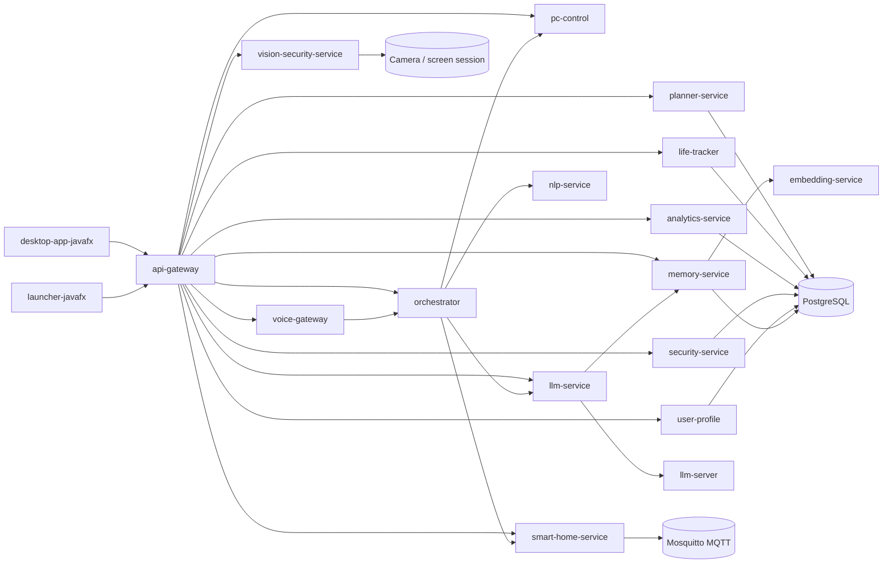

# Jarvis Architecture

This document describes the architecture that is actually wired into the current build and runtime.

## Canonical Paths

- Root build: `pom.xml`
- Local backend runtime: `scripts/runtime-up.sh`
- Kubernetes runtime: `k8s/base` plus overlays under `k8s/overlays/`
- Product launcher: `apps/launcher-javafx`
- Desktop UI: `apps/desktop-app-javafx`

## Runtime Topology

## Core Runtime

The default local runtime path starts and deploys this backend set:

- `security-service`
- `user-profile`
- `nlp-service`
- `orchestrator`
- `voice-gateway`
- `pc-control`
- `vision-security-service`
- `smart-home-service`
- `life-tracker`
- `analytics-service`
- `api-gateway`
- `planner-service`

Kubernetes still deploys the existing cluster-backed services; `vision-security-service`
is local-runtime only because it depends on the Ubuntu desktop session, webcam, and local screen state.

## Optional Runtime

The AI and memory path is optional and feature-flagged:

- `llm-service`
- `llm-server`
- `memory-service`
- `embedding-service`

Core assistant flows must remain usable without them.

## Desktop Architecture

- `launcher-javafx` is the operational shell for install, start/stop, health, diagnostics, and optional AI toggles.
- `desktop-app-javafx` is the only supported desktop launch artifact.
- `desktop-client-javafx` is still part of the build graph because `desktop-app-javafx` depends on it internally.

There is no second supported desktop runtime path.

## Build Truth

The Maven reactor is the build contract. If a module is not in `pom.xml`, it is not part of the supported build.

Current reactor groups:

- shared: `jarvis-common`
- core backend: gateway, orchestration, domain, support services listed above, plus the local-only `vision-security-service`
- desktop: `desktop-client-javafx`, `desktop-app-javafx`, `launcher-javafx`

## Operational Rules

- `api-gateway` is the public edge.
- Domain services own persistence and validation.
- `llm-service` can plan and route, but does not replace domain ownership.
- Local runtime and Kubernetes manifests outrank stale docs.
