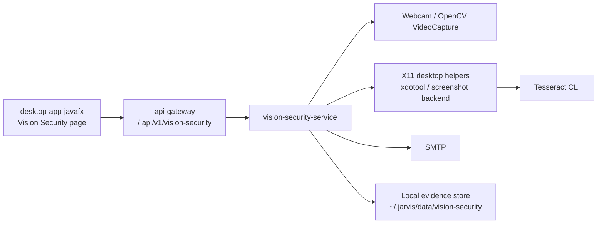

# Architecture

## Service Boundary

`vision-security-service` is a standalone Spring Boot service with direct access to the local Ubuntu desktop session. It owns webcam sampling, face verification, evidence generation, incident persistence, and alert delivery.

It does not depend on a remote CV/VLM backend for the MVP. The only outbound dependency is optional SMTP delivery.

## Component Diagram

## Internal Service Structure

- `CameraCaptureService`: grabs one webcam frame on demand with OpenCV `VideoCapture`
- `VisionPipelineService`: enhancement, segmentation, cleaning, detection, overlay export, and final decision aggregation
- `FaceVerificationService`: owner-vs-unknown classification using local LBPH face recognition
- `MonitoringDecisionEngine`: consecutive-unknown debounce and cooldown state
- `EnrollmentStore`: owner sample persistence and threshold metadata
- `IncidentStore`: incident directory creation, JSON persistence, retention pruning
- `ScreenshotService`: screenshot capture through `gnome-screenshot`, `scrot`, `import`, or Java `Robot`
- `OcrService`: local `tesseract` extraction into `screen-ocr.txt`
- `ScreenContextService`: active window title, active process, OCR text, semantic tags
- `EmailAlertService`: SMTP alert composition and attachment delivery
- `VisionSecurityController`: local API surface for desktop control and incident inspection

## Data Flow

### Monitoring Tick

1. Scheduler fires every `vision-security.monitoring.check-interval-ms`.
2. `CameraCaptureService` reads one frame from the configured device.
3. `VisionPipelineService` enhances the frame, segments a skin-region mask, cleans it, runs Haar cascade face detection, normalizes faces, and classifies them against the enrolled owner profile.
4. The pipeline returns a binary-style decision at the service boundary:
   - `OWNER_PRESENT`
   - `UNKNOWN_PERSON`
   - `NO_FACE`
   - `UNCERTAIN`
5. `MonitoringDecisionEngine` debounces `UNKNOWN_PERSON` across multiple frames and enforces an alert cooldown.

### Incident Flow

1. A debounced unknown observation triggers incident creation.
2. The same frame is re-exported into a dedicated incident directory with all classical CV stage images.
3. The service captures a screenshot.
4. OCR is extracted from that screenshot if `tesseract` is available.
5. The active window title and process name are collected from the local session.
6. Rule-based semantic tags are derived from window text, process name, and OCR content.
7. An `incident.json` record is written locally.
8. An email alert is attempted with the webcam image, screenshot, and OCR text attached when available.

## Decision Rules

- No detected faces: `NO_FACE`
- No owner enrollment yet: `UNCERTAIN`
- At least one owner-classified face in frame: `OWNER_PRESENT`
- No owner face, but at least one uncertain face: `UNCERTAIN`
- Only unknown faces remain: `UNKNOWN_PERSON`

This rule is why `owner + unknown` in the same frame does not alert in the MVP.

## Classical CV Branch

The service explicitly keeps an explainable classical branch for course/report use:

- Original image: `original.png`
- Enhancement: gamma correction + histogram equalization + blur
- Segmentation: YCrCb skin mask
- Cleaning: morphological open + close
- Detection: contour boxes plus Haar face boxes
- Final decision: owner/unknown overlay with confidence text

The exported files are deterministic and are saved either during:

- `POST /api/v1/vision-security/pipeline/capture`
- confirmed unknown incidents

## UI Integration

The desktop integration is shell-native in `desktop-app-javafx`, not the legacy tabbed client. The page:

- reads `/vision-security/status`
- lists recent incidents
- starts and stops monitoring
- triggers owner enrollment capture
- resets enrollment
- exports a pipeline snapshot
- sends a test alert

## Config Flow

- Service defaults live in `apps/vision-security-service/src/main/resources/application.yml`
- runtime scripts export `JARVIS_VISION_SECURITY_PORT`, `VISION_SECURITY_ENABLED`, and `VISION_SECURITY_URL`
- SMTP uses `spring.mail.*` and `vision-security.email.*`
- storage defaults to `${user.home}/.jarvis/data/vision-security`

## Health Model

`/actuator/health` reports:

- camera capability
- screenshot capability
- OCR capability
- email capability
- GPU visibility
- display server
- current monitoring flag

Readiness is reported as:

- `READY`
- `DEGRADED`
- `UNAVAILABLE`
